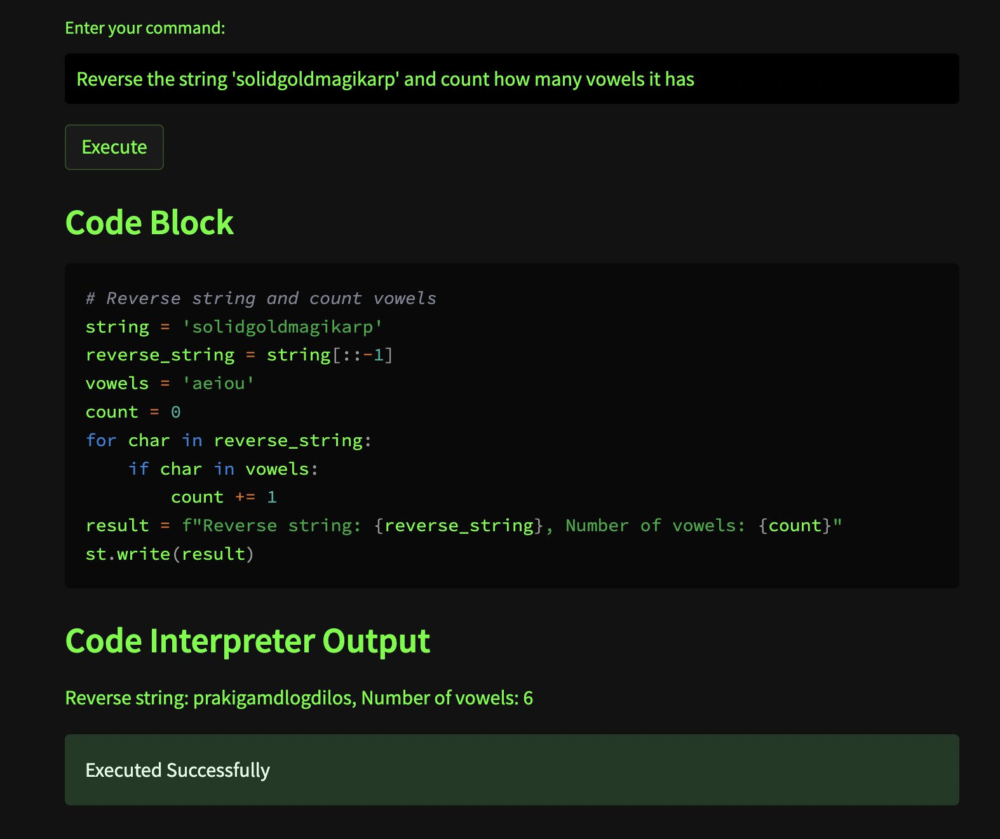
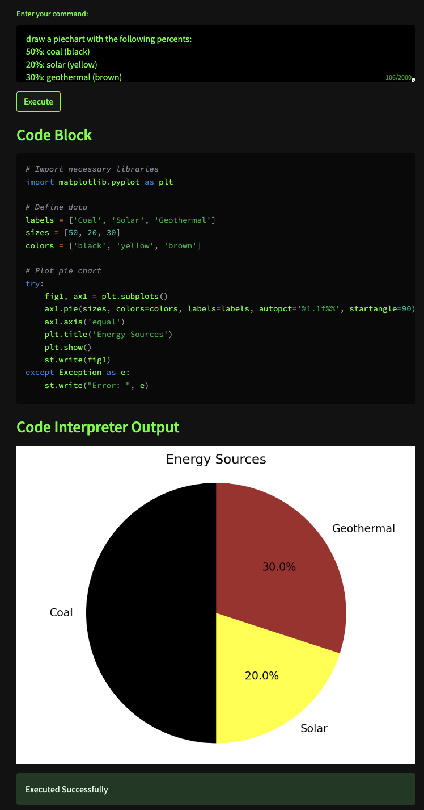
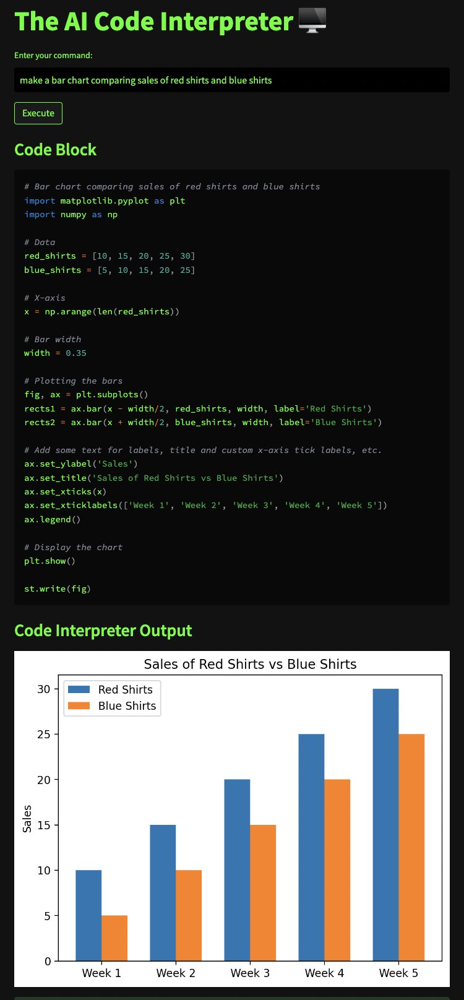

# Open Source AI Code Interpreter

**If there's interest (50 stars), I'll add more features!**

**TLDR**: This is a web app that lets you describe/ask GPT3.5/4 for code. The generated code will be automatically run for you and the output will be displayed.
You can even make graphs and charts with this.

**There are a lot of files, but you only need to care about [main.py](https://github.com/andrewgcodes/AICodeInterpreter/blob/main/main.py).**
Quickstart via Repl.it:
- The easiest way to get started is to fork this [repl](replit.com/@olafblitz/codeinterpreter).
- In the Shell, do pip install streamlit.
- Then hit run.
- You may also need to install the openai package.
- Then, in Secrets, add your OpenAI API key.

Local Installation:
- You can also run the code locally. It's a Streamlit app so just run pip install streamlit, streamlit main.py, and download necessary packages with pip.
- Set your OpenAI API key as a local variable.

## Making a pie chart

## Making a bar chart
